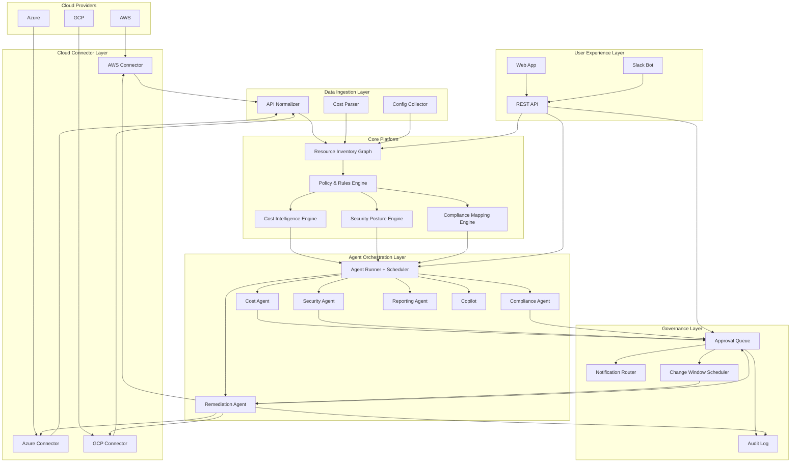

# System Architecture — CloudPilot OS

---

## Architecture Principles

1. **Read-first, write-selectively** — The platform operates primarily in read-only mode. Write capabilities (for remediation) are scoped strictly to approved actions and require explicit permission grants.
2. **Data immutability** — The audit log is append-only. Historical data is never modified.
3. **Tenant isolation** — MSP customer data is isolated at the application and data layer. No data crosses customer boundaries.
4. **Least privilege** — Cloud connectors operate with minimum read permissions. Write permissions are granted per action type, not globally.
5. **Agent determinism** — Agent outputs are grounded in platform data. Agents do not speculate or generate recommendations without a data basis.
6. **Human-in-the-loop by default** — The system is architecturally biased toward requiring human approval. Autonomy must be explicitly configured.

---

## Architecture Overview

```
┌─────────────────────────────────────────────────────────────────────────┐
│                          USER EXPERIENCE LAYER                           │
│  Web App (React)  │  API (REST/GraphQL)  │  Slack Bot  │  Reports (PDF) │
└────────────────────────────────┬────────────────────────────────────────┘
                                 │
┌────────────────────────────────▼────────────────────────────────────────┐
│                      HUMAN APPROVAL LAYER                                │
│  Approval Queue  │  Notification Router  │  Change Window Scheduler      │
└────────────────────────────────┬────────────────────────────────────────┘
                                 │
┌────────────────────────────────▼────────────────────────────────────────┐
│                    AGENT ORCHESTRATION LAYER                             │
│  Agent Runner  │  Scheduler  │  Event Bus  │  Tool Library               │
│  Cost Agent │ Security Agent │ Compliance Agent │ Remediation Agent       │
│  Reporting Agent │ Copilot │ Policy Agent │ Portfolio Agent              │
└────────┬────────────────┬────────────────┬───────────────────────────────┘
         │                │                │
┌────────▼───────┐ ┌──────▼──────┐ ┌──────▼──────┐
│ COST           │ │ SECURITY    │ │ COMPLIANCE  │
│ INTELLIGENCE   │ │ POSTURE     │ │ MAPPING     │
│ ENGINE         │ │ ENGINE      │ │ ENGINE      │
└────────┬───────┘ └──────┬──────┘ └──────┬──────┘
         │                │                │
┌────────▼────────────────▼────────────────▼───────────────────────────────┐
│                       POLICY AND RULES ENGINE                             │
│  Policy Library  │  Rule Evaluation  │  Exception Registry               │
└────────────────────────────────┬────────────────────────────────────────┘
                                 │
┌────────────────────────────────▼────────────────────────────────────────┐
│                    RESOURCE INVENTORY GRAPH                               │
│  Resource Store  │  Tag Registry  │  Dependency Map  │  Change History   │
└────────────────────────────────┬────────────────────────────────────────┘
                                 │
┌────────────────────────────────▼────────────────────────────────────────┐
│                      DATA INGESTION LAYER                                 │
│  API Normalizer  │  Cost Parser  │  Config Collector  │  Log Ingestor    │
└────────────────────────────────┬────────────────────────────────────────┘
                                 │
┌────────────────────────────────▼────────────────────────────────────────┐
│                       CLOUD CONNECTOR LAYER                               │
│  AWS Connector  │  Azure Connector  │  GCP Connector  │  Custom Connectors│
└─────────────────────────────────────────────────────────────────────────┘
                                 │
                    ┌────────────┼────────────┐
                    ▼            ▼            ▼
                  [AWS]       [Azure]       [GCP]
```

---

## Layer Descriptions

### Layer 1: Cloud Connector Layer

The connector layer is responsible for authenticating with cloud provider APIs and retrieving resource configuration, billing, and event data.

**AWS Connector:**
- Authentication: IAM Role with read-only policy (optional write role for remediation)
- Data sources: Resource configuration via AWS Config, billing via Cost and Usage Reports, security via Security Hub, events via CloudTrail
- Scan interval: Every 15 minutes for config changes; hourly for cost data; real-time for critical security events

**Azure Connector:**
- Authentication: Service Principal with Reader role (optional contributor role for remediation scoped to resource groups)
- Data sources: Azure Resource Graph for inventory, Cost Management for billing, Defender for Cloud for security
- Scan interval: Every 15 minutes

**GCP Connector:**
- Authentication: Service Account with Viewer role
- Data sources: Cloud Asset Inventory for resources, Cloud Billing for cost, Security Command Center for security findings
- Scan interval: Every 15 minutes

**Credential Security:**
- Credentials stored in secrets manager (not in database)
- Rotated automatically every 90 days
- Access to credentials restricted to connector service only
- All API calls logged

---

### Layer 2: Data Ingestion Layer

Responsible for normalizing heterogeneous cloud provider API responses into a unified internal data model.

**Components:**

- **API Normalizer:** Translates AWS, Azure, and GCP resource schemas into the platform's unified resource model
- **Cost Parser:** Normalizes billing data from cloud-provider-specific formats into a unified cost model with account, service, region, resource, and tag dimensions
- **Config Collector:** Collects resource configuration snapshots at each scan interval; stores diffs for change history
- **Log Ingestor:** Collects activity log events (creation, modification, deletion, access) for audit and anomaly detection

**Key behaviors:**
- Deduplication: Identical resources are updated in place; change events are stored as history
- Partial scan handling: If a scan fails for a subset of resources, failed resources are marked as stale
- Rate limit management: Exponential backoff with jitter for all cloud API calls

---

### Layer 3: Resource Inventory Graph

The central data store for all cloud resources and their relationships. Modeled as a property graph (nodes = resources; edges = relationships).

**Resource nodes contain:**
- Resource ID, name, type, provider, account, region, environment
- Current configuration state
- Tags
- Cost attribution
- Security finding references
- Compliance evidence references
- Last updated timestamp

**Relationship edges:**
- Instance → Security Group
- Instance → EBS Volume
- Instance → IAM Role
- Load Balancer → Target Group → Instance
- RDS → Subnet Group → VPC
- Lambda → IAM Role → S3 Bucket

**Change history:**
- Every configuration change is stored as a versioned snapshot
- Change events include: timestamp, changed fields, origin (user action vs. automated vs. external)
- Change history enables blast radius analysis, audit trails, and compliance evidence

---

### Layer 4: Policy and Rules Engine

Evaluates all resources against the library of security rules and organizational policies.

**Security rule library:**
- 400+ predefined rules across AWS, Azure, GCP
- Rules organized by category: IAM, Compute, Networking, Storage, Databases, Kubernetes, Logging
- Each rule defines: check logic, severity, remediation guidance, compliance framework mappings

**Policy evaluation:**
- Runs on every inventory scan (continuous evaluation)
- Results cached per resource; re-evaluated on any configuration change
- Exception registry consulted before generating violations

**Compliance mapping:**
- Each security rule mapped to relevant compliance framework controls
- Many-to-many mapping (one rule can satisfy multiple framework controls; one control can require multiple rules)
- Frameworks supported: SOC 2 Type II, ISO 27001, HIPAA, CIS Benchmarks, PCI DSS, NIST CSF

---

### Layer 5: Intelligence Engines

Three specialized engines process raw inventory and policy data into actionable intelligence.

**Cost Intelligence Engine:**
- Statistical baseline model: 30-day rolling baseline with seasonal adjustment
- Anomaly detection: Z-score based with configurable sensitivity
- Rightsizing engine: Utilization-based recommendation with configurable safety margins
- Idle detection: Activity threshold model per resource type
- Savings projection: Monte Carlo simulation for savings estimate ranges

**Security Posture Engine:**
- Finding aggregation from policy evaluation results
- Risk scoring: Multi-factor score combining severity, exploitability, exposure, business context
- Posture score: Weighted composite of finding counts by severity and age
- Trend analysis: Week-over-week and month-over-month posture trend

**Compliance Mapping Engine:**
- Control evidence collection: Automated evidence retrieval for cloud-mappable controls
- Readiness scoring: % of controls with passing, current evidence per framework
- Gap analysis: Identifies failing controls and generates remediation recommendations
- Evidence packaging: Assembles evidence with timestamps and source citations for audit packages

---

### Layer 6: Agent Orchestration Layer

Manages agent scheduling, execution, tool access, and state.

**Agent Runner:**
- Executes agents on schedule or on trigger
- Provides each agent with: data context, tool access, conversation memory, and output format specification
- Monitors agent execution: timeout handling, error capture, retry logic
- Returns agent outputs to appropriate downstream system (recommendation queue, report generator, etc.)

**Tool Library:**
- Registry of tools available to agents
- Each tool has: input schema, output schema, access permission requirements, rate limits
- Tool calls are logged with inputs and outputs
- Write-capable tools require additional authentication at execution time

**Event Bus:**
- Publishes events: resource created, finding detected, threshold crossed, agent completed
- Agents and workflows subscribe to relevant events
- Enables event-driven trigger patterns without polling

**Scheduler:**
- Manages recurring agent runs
- Supports cron-style scheduling and business-hour-aware scheduling
- Respects change window configurations for execution scheduling

---

### Layer 7: Human Approval Layer

All consequential actions flow through the approval layer before execution.

**Approval Queue:**
- Central queue for all pending approvals
- Items include: action details, risk tier, AI recommendation, rollback plan, approver routing
- Supports bulk approval for pre-vetted action batches
- SLA tracking: escalation if no response within configured window

**Notification Router:**
- Routes approval requests to appropriate approvers based on: action type, resource environment, risk tier
- Supports multiple channels: in-app, email, Slack, PagerDuty
- Respects notification preferences and on-call rotations

**Change Window Scheduler:**
- Maps approved actions to next available change window
- Change windows configured per environment (e.g., production: Tuesday/Thursday 22:00–02:00)
- Emergency bypass available for Critical security findings with two-person confirmation

---

### Layer 8: Reporting Layer

Generates structured reports for different audiences on schedule or demand.

**Report engine:**
- Data aggregation: pulls metrics from all platform modules for the specified period
- Narrative generation: AI-generated text sections with grounding in aggregated data
- Chart generation: pre-defined chart templates populated with current data
- Template system: audience-specific report templates (executive, technical, compliance, customer)
- Export: PDF generation, shared link, email delivery

---

### Layer 9: Audit and Observability Layer

Records all platform activity for governance, debugging, and compliance.

**Audit Log:**
- Append-only log of every action: user actions, agent actions, system events
- Each entry: timestamp, actor (user or agent), action type, resource, inputs, outputs, outcome
- Immutable after write (no update or delete)
- Queryable by resource, actor, action type, and date range
- Exportable for external audit

**Platform Observability:**
- Agent health monitoring: run success rate, error rate, latency per agent
- Connector health: scan success rate, last successful scan timestamp, API error rate
- Queue health: approval queue depth, average wait time, SLA breach alerts
- Cost of AI operations: token usage and cost per agent run tracked and reported

---

## Data Flow: End-to-End

```
1. Cloud account API (AWS/Azure/GCP)
         │
         ▼ [every 15 min]
2. Connector fetches resource configuration, billing, and events
         │
         ▼
3. Data Ingestion Layer normalizes and deduplicates
         │
         ▼
4. Resource Inventory Graph updated with new/changed resources
         │
         ▼
5. Policy and Rules Engine evaluates all resources
         │
         ├──► Security findings generated/updated
         ├──► Policy violations generated/updated
         └──► Compliance control evidence collected
         │
         ▼
6. Intelligence Engines process findings:
         │
         ├──► Cost Engine: anomalies detected, rightsizing computed
         ├──► Security Engine: risk scores updated, posture score recalculated
         └──► Compliance Engine: readiness scores updated
         │
         ▼
7. Agent Orchestration Layer: scheduled agents run, event-triggered agents run
         │
         ├──► Cost Agent: reviews findings, generates recommendations
         ├──► Security Agent: reviews findings, drafts remediation plans
         ├──► Compliance Agent: reviews gaps, updates evidence
         └──► Reporting Agent: updates data for next report cycle
         │
         ▼
8. Recommendations, workflows, and alerts generated
         │
         ▼
9. Human Approval Layer: items routed to appropriate approvers
         │
         ▼
10. On approval: Remediation Agent executes action via Cloud Connector (write)
         │
         ▼
11. Post-execution: Verification scan confirms outcome
         │
         ▼
12. Audit Log: complete action record written
         │
         ▼
13. Reporting Layer: data updated for next report
```

---

## Mermaid Architecture Diagram



See `diagrams/architecture.mmd` for the standalone diagram file.

---

## Technology Stack (Conceptual)

| Layer | Technology |
|---|---|
| Web Application | React, TypeScript, Tailwind CSS |
| API Layer | REST + GraphQL, OpenAPI spec |
| Agent Orchestration | Custom orchestration with LLM-backed reasoning |
| Data Store | PostgreSQL (relational data), Neo4j (resource graph), TimescaleDB (time-series cost/metrics) |
| Secret Management | HashiCorp Vault or cloud-native secrets manager |
| Message Queue | Apache Kafka for event bus |
| Audit Log | Append-only log store (Elasticsearch or purpose-built) |
| PDF Generation | Headless Chrome or report library |
| Cloud Integration | Cloud provider SDKs per provider |
| Background Jobs | Temporal or similar workflow orchestration |
